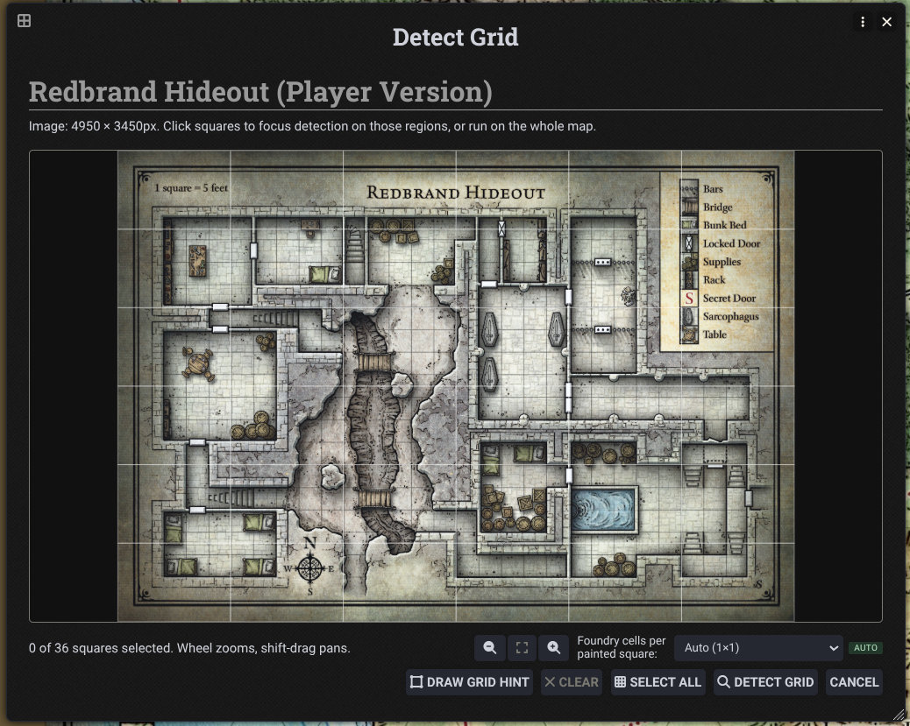
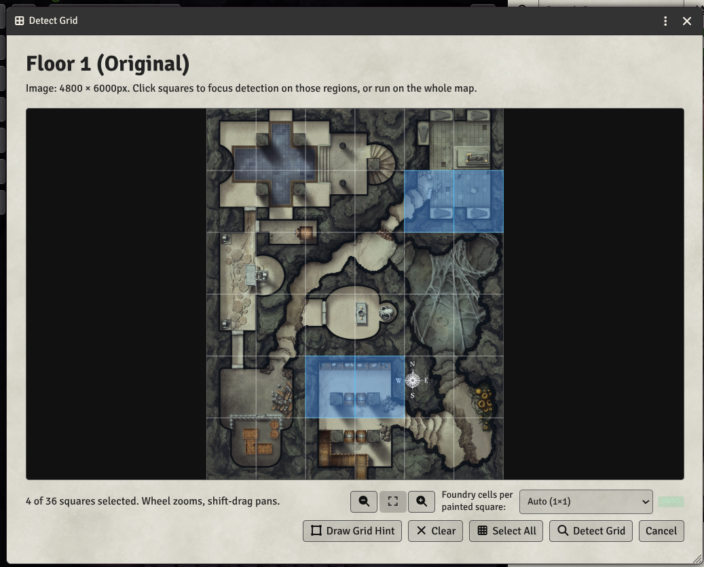

# AutoGrid

AutoGrid is a Foundry VTT module for detecting square grids in scene background images and applying the chosen grid size, offset, and scene scale.





The module exposes its API through:

```js
game.modules.get("auto-grid")?.api
window.AutoGrid
```

Useful API methods include `detectGrid`, `runDetectionForScene`, `applyChoiceToScene`, `openGridPicker`, `resolveGrid`, and `buildCandidateSummary`.


This module is forked from the DDB Importer code, and if that is active the code there is preferred.
